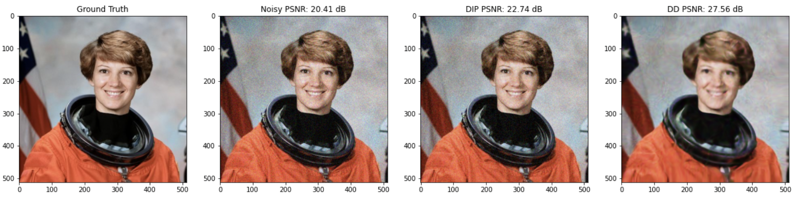
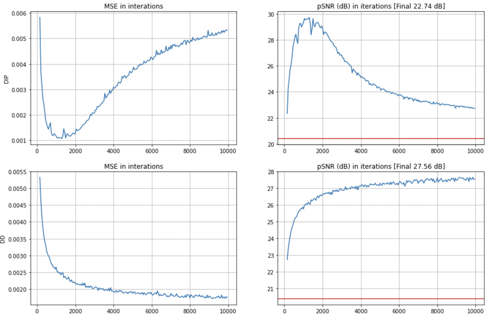

# Neural Network Image Priors

This repository contains two methods for utilizing Convolutional Neural Network (CNN) architecture as 
priors for image reconstruction. First method is the Deep Image Prior (DIP) [1]. 
DIP introduces the notion of implicit regularization for image reconstruction with
CNNs. They empirically show that without any **prior** training CNNs can be used for tasks such as 
denoising, impainting and super-resolution. However, due to the overparameterized nature of CNNs 
the models overfit to the noise in an image. An underparameterized method, namely Deep Decoder (DD) architecture achieves on par results 
with DIP via utilization of non-convolutional layers and the authors also theoretically show that the 
amount of noise DD learns is bounded [2]. Hence, DD also regularizes the complexity of the model.  

### Example results

As used in the DD paper, this repository also utilizes an image of an astronaut to test the implementations. This repository 
only tackles the denoising task. Additive white Gaussian noise is applied to the image and the models try to reconstruct the 
original input given the noisy one. Below is the original image, noisy image, output of DIP and output of DD.

Here are the training curves of the models together with MSE and pSNR changes. You can clearly see that DIP overfits after 
some iterations.

Here are the video of change in MSE together with the change in the generated images.

You can find the official implementations here
- DIP: https://github.com/DmitryUlyanov/deep-image-prior
- DD: https://github.com/reinhardh/supplement_deep_decoder

### References
[1] Ulyanov, Dmitry, Andrea Vedaldi, and Victor Lempitsky. "Deep image prior." Proceedings of the IEEE conference on computer vision and pattern recognition. 2018.  
[2] Heckel, Reinhard, and Paul Hand. "Deep decoder: Concise image representations from untrained non-convolutional networks." arXiv preprint arXiv:1810.03982 (2018).

